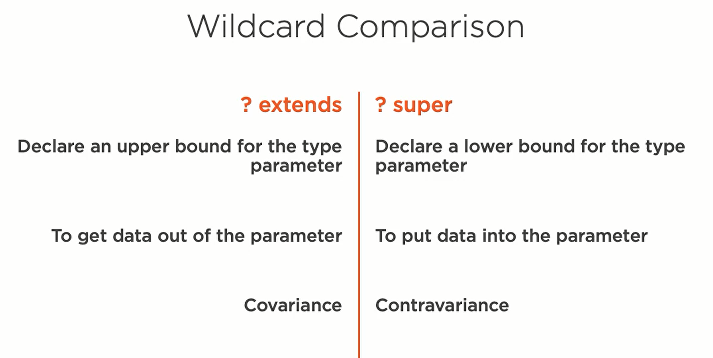

# <u>Wildcards</u>

###### What is a wildcard ?
- \<?>
------------------

<a href="../README.md">&lt;&lt; README </a>

## <u>Usage</u> :
- _**Upper Bound**_
    - `<? extends Cls>` (called _**covariant**_ )
        - _example_ :
          - if Student extends Person
            - `list<student>` is valid input for `myMethod(list<? extends Person>)`
    - \----------------------------------------------------
    - _Notes_:
      - use `<T extends Cls>` :
        - when you want to declare a class and want to restrict it
        - when you need to use the type parameter
      - \----------------------------------------------------
      - use `<? extends Cls>` :
        - where you want the additional functionality but do not need the type parameters
            - for something like a parameter in a method
    
---------------------
- _**Lower Bound**_ 
    - `<? super Cls>` (called **contravariant**)
    
---------------
### <u>**_comparison between upper and lower bounds_**</u>

- _if you need to put and get at the same time :_
    - `do not use wildcard at all`
----------------
- _**unbound**_
    - `<?>`
    - - Example :
        - `Class<?> Cls = Class.forName(myClassName);`
    - usage :
        - instead of \<? extends Object>
-----

### the Substitution principle
- if `S` is a subtype of `T`, then objects of type `T` may be replaced with objects of type `S`
    - _arrays are covariant but collections are not (you can not use a list of S in place of list of T)_ 

--------------------------

<a href="../README.md">&lt;&lt; README </a>

    